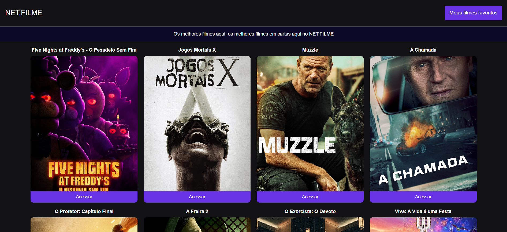

## NET FILME 

<h1>
         
</h1>

Aplicação que utiliza integração com API, hooks que exibe informações sobre filmes em cartaz.

A aplicação é uma página web que exibe informações sobre filme, incluindo títulos, imagens e subtítulos de diferentes posts relacionados ao tema, vindo da API.

- Interface intuitiva.
- Boas praticas.
- Integração com API.
- Design responsivo.
- Biblioteca toastify.
- Biblioteca axios.

## Funcionabilidade

- Usuário tem a opção de favoritar um filme, ver detalhes e excluir o filme desejado.
- Os filmes salvos são armazenados no JSON.

## 🔧 Tecnologias

 JavaScript  React
 Git
